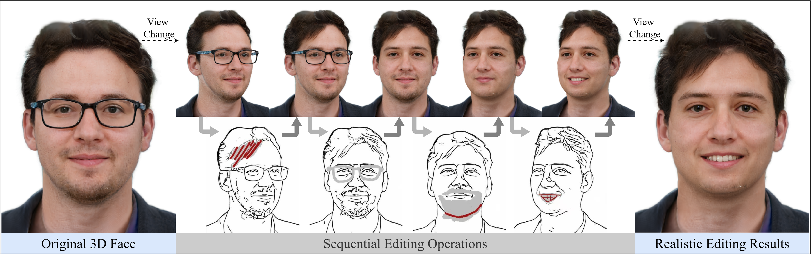

# SketchFaceGS: Real-Time Sketch-Driven Face Editing and Generation with Gaussian Splatting

**Official Implementation (CVPR 2026 Accepted)**

[](#)
[](#)

<p align="center">
  
</p>

## Abstract

3D Gaussian representations have emerged as a powerful paradigm for digital head modeling, achieving photorealistic quality with real-time rendering. However, intuitive and interactive creation or editing of 3D Gaussian head models remains challenging. Although 2D sketches provide an ideal interaction modality for fast, intuitive conceptual design, they are sparse, depth-ambiguous, and lack high-frequency appearance cues, making it difficult to infer dense, geometrically consistent 3D Gaussian structures from strokes—especially under real-time constraints. 

To address these challenges, we propose **SketchFaceGS**, the first sketch-driven framework for real-time generation and editing of photorealistic 3D Gaussian head models from 2D sketches. Our method uses a feed-forward, coarse-to-fine architecture. A Transformer-based UV feature-prediction module first reconstructs a coarse but geometrically consistent UV feature map from the input sketch, and then a 3D UV feature enhancement module refines it with high-frequency, photorealistic detail to produce a high-fidelity 3D head. For editing, we introduce a UV Mask Fusion technique combined with a layer-by-layer feature-fusion strategy, enabling precise, real-time, free-viewpoint modifications. Extensive experiments show that SketchFaceGS outperforms existing methods in both generation fidelity and editing flexibility, producing high-quality, editable 3D heads from sketches in a single forward pass.

## 🚀 News

- **[2026-02]** Our paper has been accepted to **CVPR 2026**! 🎉
- **[Coming Soon]** Training code, inference scripts, and pre-trained models will be released here. Stay tuned!

## Citation

If you find our work useful in your research, please consider citing:

```bibtex
@inproceedings{li2026sketchfacegs,
  title={SketchFaceGS: Real-Time Sketch-Driven Face Editing and Generation with Gaussian Splatting},
  author={Li, Bo and Kang, Jiahao and Ma, Yubo and Liu, Feng-Lin and Liu, Bin and Zhang, Fang-Lue and Gao, Lin},
  booktitle={Proceedings of the IEEE/CVF Conference on Computer Vision and Pattern Recognition (CVPR)},
  year={2026}
}